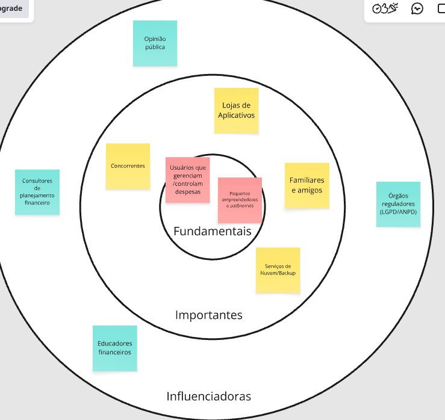

# Introdução

Informações básicas do projeto.

- Projeto: Control
- Repositório GitHub: [[LINK]](https://github.com/CibeleBgm/Trabalho-interdiciplinar-.git)
- Membros da equipe:

  #
- Cibele Gomes
- Isabelle Fernandes
- Joaquim Fernandes
- Junio César
- Pedro Cristian
- Ryan Gabriel

A documentação do projeto é estruturada da seguinte forma:

1. Introdução
2. Contexto
3. Product Discovery
4. Product Design
5. Metodologia
6. Solução
7. Referências Bibliográficas

# 1. Contexto do Projeto

## 1.1 Problema
A maioria dos brasileiros enfrenta desafios para gerenciar suas finanças pessoais, seja devido à renda incerta dos trabalhadores autônomos, que representam aproximadamente 30,2 milhões de indivíduos no Brasil, ou pela ausência de costume de rastrear receitas e despesas para os empregados CLT com salário fixo. Em ambas as situações, o desfecho é similar: dificuldades para economizar, dívidas no cartão de crédito ou no cheque especial, além de ansiedade ao manusear dinheiro. 
Quem possui renda variável geralmente faz o planejamento financeiro com base na média de rendimentos, o que se desfaz nos meses de baixa, e muitas vezes se esquece de prever impostos e reservas. Por outro lado, aqueles com renda fixa costumam perder o controle sobre o destino do salário, especialmente através de compras por impulso, e acabam recorrendo ao crédito rotativo para equilibrar as contas no final do mês. Existem poucos aplicativos financeiros simples disponíveis no mercado que satisfaçam os dois perfis. A maioria das ferramentas atuais se baseia na suposição de que o usuário possui um salário estável e um conhecimento financeiro básico, o que exclui uma parte significativa da população.

## 1.2 Objetivo do Projeto

Desenvolver uma aplicação de controlo financeiro pessoal que ajude os utilizadores, independentemente do seu perfil de rendimento fixo ou variável, a gerir as suas despesas, compreender onde é que o seu dinheiro está a ser gasto e construir uma reserva financeira, através de uma interface simples e acessível mesmo para aqueles que têm poucos conhecimentos sobre finanças.

Automatizar a classificação dos gastos por categoria (alimentação, saúde, compras, etc.), permitindo a correção rápida pelo utilizador sempre que a categorização estiver incorreta.

Oferecer ferramentas de planeamento e acompanhamento de metas de poupança, com visualização gráfica do progresso, adaptadas tanto a quem recebe um salário fixo como a quem tem uma renda variável.

Disponibilizar conteúdos de educação financeira básica sobre economia, investimentos e formas de poupar dinheiro, utilizando uma linguagem simples e não técnica.
### Objetivos Específicos

* Facilitar o registro e a organização de receitas e despesas.
* Permitir a classificação das movimentações por categorias.
* Possibilitar a separação entre movimentações pessoais e relacionadas a negócios.
* Auxiliar o usuário no acompanhamento de seus gastos ao longo do período.
* Facilitar a identificação dos hábitos de consumo e das principais categorias de despesas.

## 1.3 Justificativa

A escolha deste tema é justificada pelos dados obtidos na fase de investigação: apenas 14,3% dos cidadãos brasileiros conseguem efetuar um cálculo simples de juros; 62,9% não sabem quanto gastam por mês e 72,4% têm dificuldade em pagar as despesas mensais, sendo que 46,2% deixam de pagar pelo menos uma fatura. De acordo com um estudo da Serasa, a faixa etária dos 26 aos 40 anos representa a maior fatia de pessoas com dívidas em atraso no Brasil, o que corresponde precisamente ao perfil de parte do nosso público-alvo.

Optámos por nos concentrarmos especialmente no atendimento a rendimentos variáveis e trabalhadores independentes, visto serem um público mal atendido pelas aplicações financeiras tradicionais, que costumam usar o "salário fixo" como referência orçamental, o que não funciona para quem não sabe quanto vai ganhar no mês seguinte. Ao mesmo tempo, mantivemos o foco nos utilizadores com rendimento fixo e dificuldade em controlar os gastos, visto serem o perfil mais numeroso e mais suscetível a fazer compras por impulso e a contrair dívidas com o cartão de crédito.

## 1.4 Público-alvo

O aplicativo é voltado para pessoas entre 20 e 45 anos que buscam mais controle sobre suas finanças pessoais, com diferentes níveis de conhecimento financeiro e diferentes perfis de renda:

•	Trabalhadores autônomos com renda mensal irregular, sem rede de segurança financeira (ex: prestadores de serviço, diaristas).

•	Trabalhadores CLT com renda fixa, mas com dificuldade de controlar gastos por impulso e evitar o cartão de crédito.

•	Jovens em início de carreira (estagiários, primeiro emprego), buscando desenvolver hábitos financeiros e se organizar para o futuro.

De forma geral, é um público com pouco ou nenhum conhecimento técnico sobre finanças, que relaciona qualquer ferramenta "financeira" à ideia de auditoria ou julgamento, e que precisa de uma comunicação simples, visual e sem jargões. 

## 2. Product Discovery
## 2.1 Matriz CSD (Matriz de Alinhamento)

A Matriz CSD foi utilizada para organizar os conhecimentos, dúvidas e hipóteses levantados pela equipe durante o processo de entendimento do problema.

*Certezas*

A maioria das pessoas ainda recorre a planilhas ou meios paralelos para controle financeiro.

O medo de expor senhas bancárias ainda é um obstáculo para a adoção de automações financeiras.

Muitas pessoas se lembram de organizar as finanças principalmente quando ficam sem dinheiro no fim do mês.

*Dúvidas*

Os usuários gostariam de ter acesso a conteúdos de educação financeira básica dentro do aplicativo?

Quanto mais simples e intuitiva for a utilização, menor será o abandono da ferramenta?

O principal motivo de abandono de aplicativos financeiros é a dificuldade ou falta de hábito de registrar cada gasto manualmente no momento da compra?

*Suposições*

O usuário utilizará o aplicativo com frequência.

Lembretes por notificação podem contribuir para aumentar a utilização da ferramenta.

O usuário deseja visualizar gráficos sobre seus gastos.

Pequenas compras realizadas no dia a dia podem ser mais difíceis de registrar e acompanhar.

Artefato:

## 2.2 Mapa de Stakeholders

O mapa de stakeholders foi elaborado para identificar as pessoas, organizações e grupos que possuem algum envolvimento com o problema, com o desenvolvimento ou com a utilização da solução.

### Pessoas fundamentais

Principais envolvidos no problema e potenciais usuários da solução:

* Usuários que gerenciam e controlam suas despesas.
* Pequenos empreendedores e trabalhadores autônomos.

### Pessoas importantes

Stakeholders que podem influenciar o desenvolvimento ou a utilização da solução:

* Lojas de aplicativos.
* Concorrentes e outros aplicativos financeiros.
* Familiares e amigos.
* Órgãos reguladores relacionados à proteção de dados, como a ANPD.
* Serviços de nuvem e backup.

### Pessoas influenciadoras

Stakeholders que podem contribuir com avaliações e conhecimentos relacionados ao problema e à solução:

* Opinião pública.
* Consultores de planejamento financeiro.
* Educadores financeiros.

**Artefato:**

## 2.3 Pesquisa e Entendimento do Problema

Metodologia adotada: 

O grupo optou por uma pesquisa exploratória baseada em levantamento de dados secundários (estatísticas de institutos e órgãos especializados em finanças pessoais no Brasil), usados como base para embasar a criação das personas e do Mapa de Empatia.

Fontes consultadas

Serasa: levantamento sobre inadimplência por faixa etária.
Pesquisas de mercado sobre trabalho autônomo no Brasil.
Levantamentos sobre educação financeira e hábitos de consumo da população brasileira.

Resultados encontrados

O Brasil tem cerca de 30,2 milhões de trabalhadores autônomos, grupo que costuma calcular o orçamento pela renda média (e não pela mínima), o que compromete o planejamento nos meses de renda mais baixa, além de frequentemente esquecer de provisionar impostos e taxas.
Cerca de 34% dos brasileiros entre 26 e 40 anos representam a maior fatia de inadimplentes do país, segundo o Serasa.
Apenas 14,3% dos brasileiros conseguem fazer um cálculo simples de juros — reforça a necessidade de linguagem simples e visual, sem jargão financeiro.
62,9% das pessoas não sabem quanto gastam por mês.
72,4% da população tem dificuldade para pagar as despesas mensais, e 46,2% atrasam pelo menos uma conta.

### Principais fontes consultadas

* Serasa Experian.
* Banco Central do Brasil.
* IBGE.
* SPC Brasil e CNDL.

Os resultados dessa pesquisa serviram como base para a definição do problema, do público-alvo e das personas utilizadas nas etapas seguintes.

## 2.4 Personas

Com base no problema identificado e no público-alvo definido, foram elaboradas três personas que representam diferentes perfis de usuários que podem utilizar a solução.

### Regina Silva — Profissional com renda variável

Regina Silva representa uma usuária que possui rendimento variável e precisa lidar com diferentes valores de renda ao longo dos meses.

**Perfil:**

* Profissional com renda variável.
* Possui dificuldade para prever quanto poderá gastar em cada mês.
* Precisa se preparar para períodos de menor rendimento.
* Busca construir uma reserva financeira.

**Necessidades:**

* Ter uma referência de renda segura para planejar os gastos.
* Acompanhar sua reserva financeira.
* Organizar receitas e despesas.
* Visualizar seu histórico financeiro.

**Dificuldades:**

* Variação da renda mensal.
* Necessidade de reservar dinheiro para impostos e emergências.
* Incerteza sobre os valores disponíveis para gastar.

### Camila Andrade — Trabalhadora com renda fixa

Camila Andrade representa uma usuária com renda estável, mas que possui dificuldades relacionadas ao controle dos gastos e às compras por impulso.

**Perfil:**

* Possui renda fixa.
* Tem dificuldade para acompanhar o destino do próprio salário.
* Pode realizar compras por impulso.
* Deseja melhorar seus hábitos financeiros.

**Necessidades:**

* Visualizar seus gastos de forma simples.
* Identificar comportamentos de consumo.
* Acompanhar o progresso de suas economias.
* Compreender os impactos de determinadas compras.

**Dificuldades:**

* Compras por impulso.
* Controle da fatura do cartão.
* Falta de uma visão simples dos gastos durante o mês.

### Lucas Martins — Jovem em início de carreira

Lucas Martins representa um usuário que está começando sua vida profissional e deseja desenvolver hábitos de organização financeira.

**Perfil:**

* Está no início da carreira.
* Possui pouca experiência com planejamento financeiro.
* Deseja aprender a organizar suas receitas e despesas.
* Busca criar hábitos financeiros para o futuro.

**Necessidades:**

* Registrar movimentações de forma simples.
* Entender para onde seu dinheiro está indo.
* Criar e acompanhar metas financeiras.
* Ter acesso a conteúdos básicos sobre educação financeira.

**Dificuldades:**

* Pouco conhecimento sobre finanças.
* Falta de experiência com planejamento financeiro.
* Dificuldade para interpretar informações financeiras complexas.

# 3. Product Design

## 3.1 Histórias de Usuários

A partir das personas identificadas, foram elaboradas histórias de usuários para representar necessidades e funcionalidades esperadas pelos diferentes perfis.

### Regina Silva

* Como usuária de rendimento variável, desejo que o aplicativo calcule automaticamente uma "renda segura", baseada na minha renda mínima, média e máxima, para que eu possa planejar meus gastos sem prejudicar os meses de menor rendimento.

* Como usuária independente, desejo destinar automaticamente uma parcela de cada Pix que recebo para pagamento de impostos e reserva, para evitar surpresas no final do mês.

* Como uma usuária que obtém informações de diversas fontes, desejo visualizar um histórico básico de meses favoráveis e desfavoráveis, para me organizar com mais segurança.

* Como usuária sem proteção financeira, desejo monitorar visualmente meu objetivo de reserva, em meses de custo de vida, para entender o quanto ainda preciso acumular.

### Camila Andrade

* Como usuária com renda fixa, desejo visualizar um painel simples que mostre o destino do meu dinheiro ao longo do mês, facilitando a compreensão dos meus gastos sem a necessidade de consultar planilhas.

* Como consumidora que realiza compras por impulso, desejo receber notificações sobre possíveis compras por impulso à noite ou aos finais de semana, para me auxiliar a evitar gastos desnecessários.

* Como usuária que acompanha a fatura do cartão, desejo utilizar um simulador que mostre o custo real de entrar no crédito rotativo, para compreender melhor as consequências dessa escolha.

* Como usuária que deseja guardar dinheiro, quero acompanhar o progresso da minha economia mês a mês de forma visual e simples, para acompanhar minha evolução.

### Lucas Martins

* Como usuário no início da carreira, quero registrar minhas receitas e despesas de forma simples, para começar a desenvolver o hábito de controle financeiro.

* Como usuário com pouca experiência financeira, quero visualizar relatórios e gráficos simples dos meus gastos, para entender onde meu dinheiro está sendo utilizado.

* Como usuário que deseja se planejar, quero criar metas financeiras, como uma reserva ou objetivo específico, e acompanhar seu progresso.

* Como usuário iniciante, quero acessar conteúdos básicos de educação financeira dentro do próprio aplicativo, para aprender aos poucos sem precisar buscar essas informações em outro lugar.

## 3.2 Proposta de Valor

[Inserir o mapa/diagrama da proposta de valor.]

## 3.3 Projeto de Interface

### 3.3.1 Fluxo do Usuário

[Inserir o fluxo das telas.]

### 3.3.2 Wireframes

[Inserir os wireframes.]

### 3.3.3 Protótipo Interativo

[Inserir o link do Figma/protótipo.]

# 4. Metodologia

## 4.1 Ferramentas

[Lista das ferramentas utilizadas + links + justificativa.]

## 4.2 Organização da Equipe e Divisão de Papéis

[Explicar como a equipe se organizou, divisão de tarefas e utilização do Scrum.]

## 4.3 Kanban

[Inserir imagem do Kanban e link para o quadro.]

## 4.4 Referências

• SERASA (dados IBGE 2022). Saiba como é o trabalho autônomo. Disponível em: https://www.serasa.com.br/blog/como-e-trabalho-autonomo 
• BANCO CENTRAL DO BRASIL. Pesquisa de Letramento e Inclusão Financeira, em parceria com o Fundo Garantidor de Créditos (FGC). Disponível em: https://convergenciadigital.com.br/?p=27092  
• IBGE. Pesquisa de Orçamentos Familiares (POF) 2017-2018: Perfil das Despesas. Agência de Notícias IBGE, 19/08/2021. Disponível em: https://agenciadenoticias.ibge.gov.br/agencia-noticias/31401-72-4-dos-brasileirosvivem-em-familias-com-dificuldades-para-pagar-as-contas.html  
• SPC BRASIL; CNDL. Pesquisa sobre educação financeira e controle de orçamento dos brasileiros. Disponível em: https://www.spcbrasil.org.br/uploads/st_imprensa/release_educacao_financeira_v7.pd  
• SERASA EXPERIAN. Mapa da Inadimplência (levantamento mensal por faixa etária). Disponível em: https://vitrine.sebraego.com.br/wpcontent/uploads/2025/07/mapa-da-inadimplencia-maio-serasa.pdf  
• https://vitrine.sebraego.com.br/wp-content/uploads/2025/07/mapa-da-inadimplenciamaio-serasa.pdf  
• https://agenciadenoticias.ibge.gov.br/agencia-noticias/31401-72-4-dos-brasileirosvivem-em-familias-com-dificuldades-para-pagar-as-contas.html 

• https://convergenciadigital.com.br/?p=27092

• https://www.spcbrasil.org.br/uploads/st_imprensa/release_educacao_financeira_v7.pd

• https://www.serasa.com.br/blog/como-e-trabalho-autonomo 
