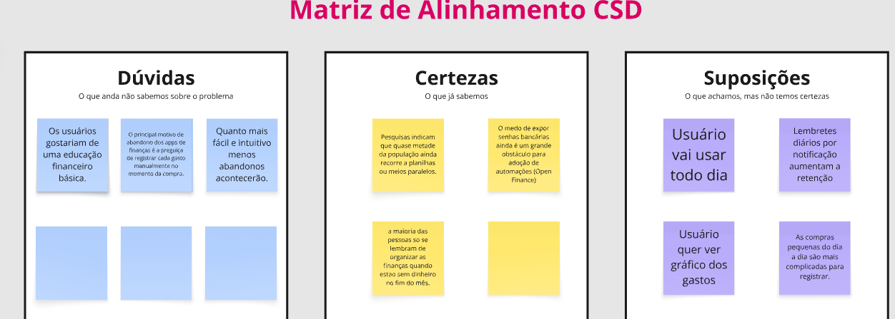

# Introdução

Informações básicas do projeto.

- Projeto: Control
- Repositório GitHub: [[LINK]](https://github.com/CibeleBgm/Trabalho-interdiciplinar-.git)
- Membros da equipe:

  #
- Cibele Gomes
- Isabelle Fernandes
- Joaquim Fernandes
- Junio César
- Pedro Cristian
- Ryan Gabriel

A documentação do projeto é estruturada da seguinte forma:

1. Introdução
2. Contexto
3. Product Discovery
4. Product Design
5. Metodologia
6. Solução
7. Referências Bibliográficas

# 1. Contexto do Projeto

## 1.1 Problema

Muitas pessoas possuem dificuldade para acompanhar e organizar suas receitas e despesas ao longo do mês. A falta de um controle financeiro simples pode fazer com que o usuário não tenha uma visão clara de quanto está gastando, em quais categorias concentra seus gastos e quanto ainda possui disponível para utilizar.

Esse problema pode ser ainda mais relevante quando a pessoa possui diferentes tipos de despesas, como alimentação, transporte, lazer, contas e compras, ou quando precisa separar gastos pessoais de gastos relacionados a atividades profissionais ou negócios.

Dessa forma, existe a necessidade de compreender melhor os hábitos de controle financeiro das pessoas e as dificuldades encontradas por elas no acompanhamento de suas movimentações financeiras.

## 1.2 Objetivo do Projeto

### Objetivo Geral

Desenvolver uma solução de software que auxilie os usuários no controle e na organização de suas receitas e despesas, permitindo acompanhar suas movimentações financeiras de maneira simples e organizada.

### Objetivos Específicos

* Facilitar o registro e a organização de receitas e despesas.
* Permitir a classificação das movimentações por categorias.
* Possibilitar a separação entre movimentações pessoais e relacionadas a negócios.
* Auxiliar o usuário no acompanhamento de seus gastos ao longo do período.
* Facilitar a identificação dos hábitos de consumo e das principais categorias de despesas.

## 1.3 Justificativa

O controle das movimentações financeiras é importante para que as pessoas possam compreender melhor como seus recursos estão sendo utilizados. Quando os gastos não são registrados ou organizados, torna-se mais difícil acompanhar o orçamento e identificar situações que podem comprometer o planejamento financeiro.

O projeto é motivado pela necessidade de oferecer uma forma simples de registrar e organizar essas informações, evitando que o usuário precise utilizar métodos dispersos, como anotações manuais ou diferentes ferramentas para acompanhar seus gastos.

A definição dos objetivos específicos busca atender principalmente às dificuldades relacionadas ao registro, à classificação e ao acompanhamento das movimentações financeiras. A organização por categorias e a separação entre gastos pessoais e de negócio também permitem uma visualização mais adequada das informações registradas.

## 1.4 Público-alvo

O projeto é direcionado principalmente a pessoas que desejam organizar melhor suas finanças e acompanhar suas receitas e despesas no dia a dia.

Entre os possíveis usuários estão estudantes, trabalhadores, autônomos e pessoas que possuem atividades profissionais ou pequenos negócios e precisam acompanhar tanto movimentações pessoais quanto relacionadas ao trabalho.

O público-alvo não precisa possuir conhecimentos avançados de tecnologia ou de educação financeira. A proposta considera usuários que buscam uma forma prática e simples de registrar suas movimentações e visualizar sua situação financeira.

2. Product Discovery
2.1 Matriz CSD (Matriz de Alinhamento)

A Matriz CSD foi utilizada para organizar os conhecimentos, dúvidas e hipóteses levantados pela equipe durante o processo de entendimento do problema.

Certezas
A maioria das pessoas ainda recorre a planilhas ou meios paralelos para controle financeiro.
O medo de expor senhas bancárias ainda é um obstáculo para a adoção de automações financeiras.
Muitas pessoas se lembram de organizar as finanças principalmente quando ficam sem dinheiro no fim do mês.
Dúvidas
Os usuários gostariam de ter acesso a conteúdos de educação financeira básica dentro do aplicativo?
Quanto mais simples e intuitiva for a utilização, menor será o abandono da ferramenta?
O principal motivo de abandono de aplicativos financeiros é a dificuldade ou falta de hábito de registrar cada gasto manualmente no momento da compra?
Suposições
O usuário utilizará o aplicativo com frequência.
Lembretes por notificação podem contribuir para aumentar a utilização da ferramenta.
O usuário deseja visualizar gráficos sobre seus gastos.
Pequenas compras realizadas no dia a dia podem ser mais difíceis de registrar e acompanhar.

Artefato:

## 2.2 Mapa de Stakeholders

[Inserir Mapa de Stakeholders]

## 2.3 Pesquisa e Entendimento do Problema

[Descrever as pesquisas realizadas, fontes consultadas, entrevistas/questionários e resultados.]

## 2.4 Personas

[Descrever as personas identificadas.]

# 3. Product Design

## 3.1 Histórias de Usuários

[Inserir as histórias de usuários desenvolvidas pelo grupo.]

## 3.2 Proposta de Valor

[Inserir o mapa/diagrama da proposta de valor.]

## 3.3 Projeto de Interface

### 3.3.1 Fluxo do Usuário

[Inserir o fluxo das telas.]

### 3.3.2 Wireframes

[Inserir os wireframes.]

### 3.3.3 Protótipo Interativo

[Inserir o link do Figma/protótipo.]

# 4. Metodologia

## 4.1 Ferramentas

[Lista das ferramentas utilizadas + links + justificativa.]

## 4.2 Organização da Equipe e Divisão de Papéis

[Explicar como a equipe se organizou, divisão de tarefas e utilização do Scrum.]

## 4.3 Kanban

[Inserir imagem do Kanban e link para o quadro.]
